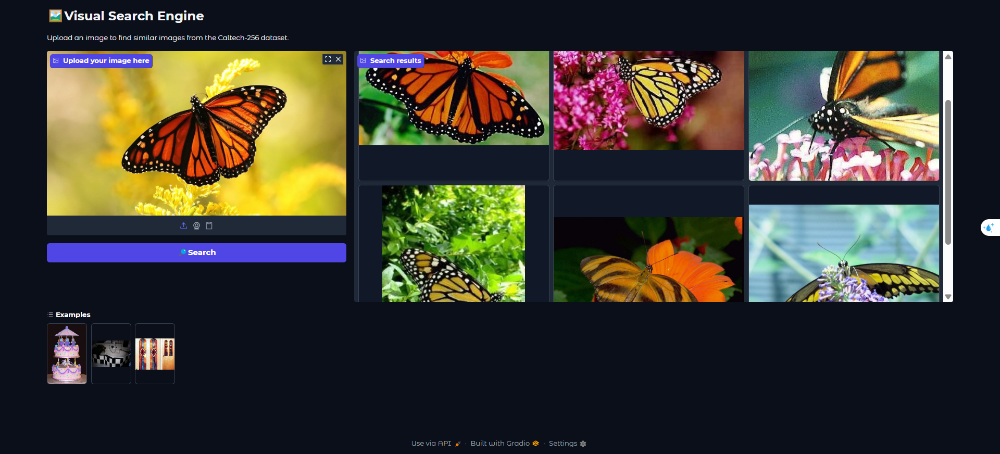

# 🖼️ Caltech256 Visual Similarity Search

A lightning-fast image similarity search engine powered by [OpenAI CLIP](https://github.com/openai/CLIP) and [FAISS](https://github.com/facebookresearch/faiss), built for the Caltech256 image dataset.


---

## 📚 About the Caltech256 Dataset

**Caltech256** is a popular benchmark dataset for object recognition and visual search research. It contains:
- **256 object categories** (e.g., dog, car, cake, guitar, etc.)
- **30,607 total images** (80–827 per class)
- Each category is a separate folder, named like `001.ak47`, `002.american-flag`, ..., `256.yin-yang`

**More info & download:**  
- [Official Caltech256 page](https://data.caltech.edu/records/nyy15-4j048)
- [Direct download link (1.2 GB, tar)](https://data.caltech.edu/records/nyy15-4j048/files/256_ObjectCategories.tar?download=1)
---
## 🚀 How It Works

- **Feature Extraction:** Every image in the dataset is encoded into a 512-dim feature vector by CLIP ViT-B/32.
- **Indexing:** All features are stored in a FAISS index for ultra-fast similarity search (cosine similarity).
- **Retrieval:** User uploads a query image → it’s embedded and searched against all Caltech256 images → the most similar images are shown in a gallery.

---

## 🛠️ Usage

1. **Download Caltech256** and unzip into `./256_ObjectCategories`
2. **Install requirements:**
    ```bash
    pip install -r requirements.txt
    ```
3. **Run the app:**
    ```bash
    python app.py
    ```
4. **Open the Gradio interface** in your browser, upload a query image, and see the results!

---
## 🎬 Demo Video

[▶️ Click here to watch the demo ](assets/test_video.mp4)

---

## ✨ Features

- Super-fast image-to-image search (entire dataset in <1 sec on GPU)
- Based on [CLIP ViT-B/32](https://github.com/openai/CLIP) for robust semantic features
- Modular codebase, easy to customize or extend
- Supports CPU and GPU
- Clear English code & documentation

---
